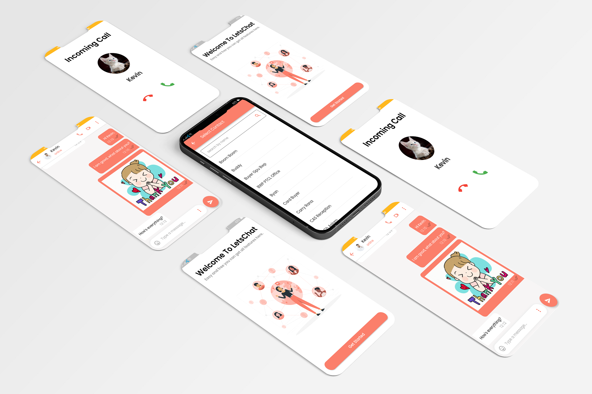

# LetsChat
### Fully Featured Chat App Using Firebase, RiverPod and much more.

LetsChat app has a beautiful responsive UI. The app includes many features like User Authentication using email and phone numbers, Online Messaging (Textual, Images, Audios),  Status/Stories, Group Chats, Video Calling, and Group Calling. The app is somewhat similar to WhatsApp.
LetsChat app built with Riverpod State Management, Firebase for authentication, messaging, and database, Agora streaming platform for video calling and group calling, and many amazing widgets.

## Features
- Phone Number Authentication
- 1-1 Chatting with Contacts Only
- Group Chatting
- Text, Image, GIF, Audio(Recording), Video & Emoji Sharing
- Status Visible to Contacts Only and Disappears after 24 hours
- Video Calling
- Online/Offline Status
- Seen Message
- Replying to Messages
- Auto Scroll on New Messages

## Tech Used
<b>Server: </b>Firebase (Firebase Auth, Firebase Core, Firebase Firestore, Firebase Storage). 
<b>State Management: </b>Riverpod 

